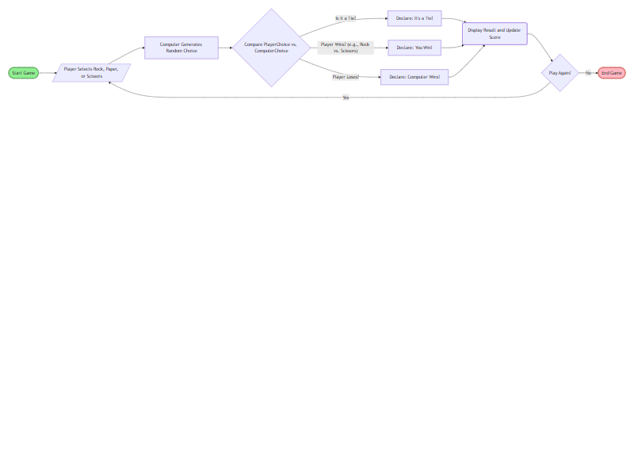

# Mermaid Flowchart Gallery 

Selamat datang di folder dokumentasi visual saya! 
Folder ini berisi 4 (empat) bentuk flowchart menggunakan Mermaid.js yang bisa langsung digunakan dan diedit. 

## 🚀 Mengapa Menggunakan Mermaid?
Mermaid memungkinkan kita membuat diagram menggunakan teks (markup), sehingga:
- **Git-friendly**: Perubahan diagram bisa dilacak lewat commit history.
- **Mudah diedit**: Tidak perlu aplikasi desain, cukup ketik kode.
- **Rapi**: GitHub merender kode ini secara otomatis menjadi diagram yang cantik.

---

## 🛠 Cara Menggunakan

Saya mengedit atau melihat flowchart ini di **VS Code**, dan menggunakan/menginstal **Markdown Preview Enhanced** extension.

### Langkah-langkah:
1. **Instal Ekstensi**:
   - Buka VS Code.
   - Pergi ke tab Extensions (Ctrl+Shift+X).
   - Cari dan instal: `Markdown Preview Enhanced`.
2. **Cara Menjalankan**:
   - Buka file `.md` yang berisi kode Mermaid.
   - Klik kanan di dalam editor kode.
   - Pilih **Markdown Preview Enhanced: Open to the Side** (atau tekan `Ctrl + K` lalu `V`).
3. **Keunggulan**:
   - Render diagram jauh lebih cepat dan akurat.
   - Bisa ekspor diagram ke format PNG, SVG, bahkan PDF dengan mudah.

> **Catatan:** Jika kamu menyalin kode ini dan terdapat tulisan `text` di baris teratas blok kode, silakan ganti menjadi `mermaid` agar kode tersebut dapat dirender menjadi flowchart.

---

## 📂 Pratinjau Flowchart
Berikut adalah daftar dokumentasi flowchart yang tersedia di repositori ini:

| Nama Diagram | Pratinjau (Thumbnail) | Link Dokumentasi |
| :--- | :---: | :--- |
| **Simple Flowchart** |  | [Lihat Kode](./simple-project/simple-Mermaid.md) |
| **Horizontal Flowchart** |  | [Lihat Kode](./horizontal-project/horizontal-Mermaid.md) |
| **Color & Shapes** |  | [Lihat Kode](./color-shapes/color-shapes-Mermaid.md) |
| **TypeScript Compilation** |  | [Lihat Kode](./typescript-docs/TypeScript-Compilation.md) |

---

## 📝 Kode Mermaid
Sebagai contoh sederhana, salin kode di bawah ini untuk menggunakannya di editor Markdown kamu.

```text
graph TD
    A[Mulai Belajar] --> B{Paham Konsep?}
    B -- Belum --> C[Baca Dokumentasi/Bikin Flowchart]
    C --> A
    B -- Sudah --> D[Implementasi Kode TS]
    D --> E[Selesai & Commit]
```

---  

## 📚 Referensi Tambahan
* [Dokumentasi Resmi Mermaid](https://mermaid-js.github.io/mermaid/) - Panduan lengkap kode dan struktur diagram.
* [Mermaid Live Editor](https://mermaid.live/) - Alat untuk mencoba kode Mermaid secara online.
* [Markdown Preview Enhanced](https://shd101wyy.github.io/markdown-preview-enhanced/) - Dokumentasi resmi ekstensi VS Code yang kita gunakan.
* [Cheat Sheet Markdown](https://www.markdownguide.org/cheat-sheet/) - Referensi cepat untuk penulisan Markdown.

---

## Contact & Connect
Terima kasih telah melihat catatan belajar saya! Jika ada pertanyaan/diskusi, saya di:

<p align="left">
  <a href="https://github.com/nurjamilahh">
    
  </a>
  <a href="https://linkedin.com/in/nur-jamilah-harahap" target="blank">
    
  </a>
  <a href="mailto:worknurjam@gmail.com">
    
  </a>
  <a href="https://wa.me/6285782602672">
    
  </a>
</p>

**Scan atau klik QR di bawah untuk terhubung di LinkedIn:**
<p align="left">
<a href="https://www.linkedin.com/in/nur-jamilah-harahap">
  
</a>
</p>

---

_This is part of the **Nurjam Projects** collection — exploring code, one experiment at a time._
