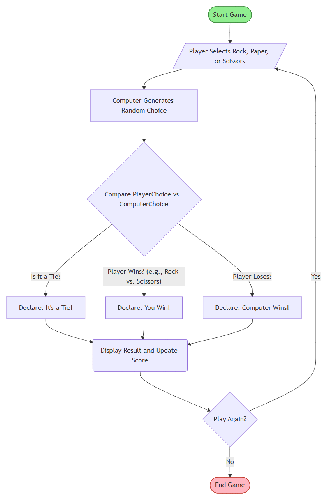
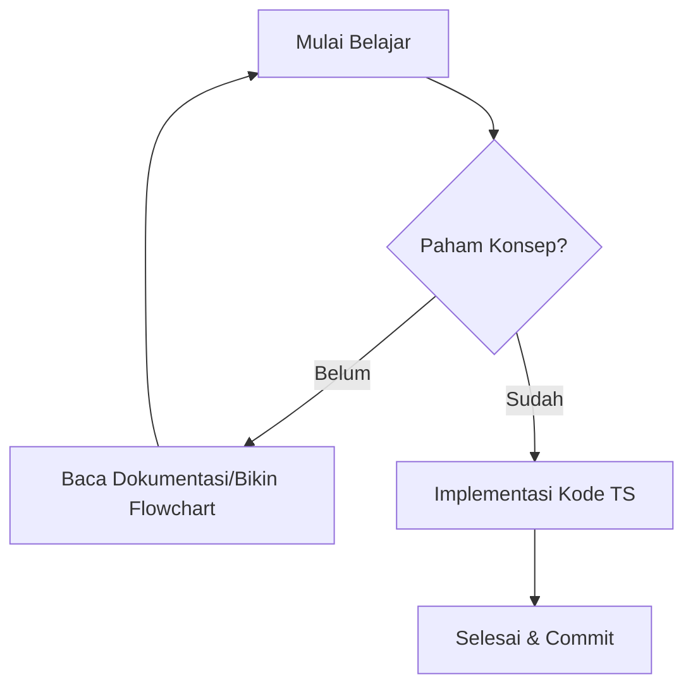

# 📊 Koleksi Mermaid Flowchart 

Selamat datang di folder dokumentasi visual saya! 
Folder ini berisi 4 (empat) bentuk Mermaid Flowchart yang saya coba buat di bulan Desember 2025 pada bulan kedua kursus software engineering. 

## 🚀 Mengapa Menggunakan Mermaid?
Mermaid memungkinkan saya untuk membuat diagram menggunakan teks (markup), sehingga:
- **Git-friendly**: Perubahan diagram bisa dilacak lewat commit history.
- **Mudah diedit**: Tidak perlu aplikasi desain, cukup ketik kode.
- **Rapi**: GitHub merender kode ini secara otomatis menjadi diagram yang cantik.

---

## 🛠 Cara Melihat Preview (Rekomendasi)

Saya mengedit atau melihat flowchart ini di **VS Code**, dan menggunakan/menginstal **Markdown Preview Enhanced** extension.

### Langkah-langkah:
1. **Instal Ekstensi**:
   - Buka VS Code.
   - Pergi ke tab Extensions (Ctrl+Shift+X).
   - Cari dan instal: `Markdown Preview Enhanced`.
2. **Cara Menjalankan**:
   - Buka file `.md` yang berisi kode Mermaid.
   - Klik kanan di dalam editor kode.
   - Pilih **Markdown Preview Enhanced: Open to the Side** (atau tekan `Ctrl + K` lalu `V`).
3. **Keunggulan**:
   - Render diagram jauh lebih cepat dan akurat.
   - Bisa ekspor diagram ke format PNG, SVG, bahkan PDF dengan mudah.

---

## 📂 Daftar Flowchart
Berikut adalah beberapa alur logika yang sudah saya petakan:

| Nama Konsep | File | Deskripsi Singkat | Preview |
| :--- | :--- | :--- | :--- |
| **simple-Mermaid** | `simple-Mermaid.md` | Mermaid Flowchart sederhana. |  |
| **color-shapes-Mermaid** | `color-shapes-Mermaid.md` | Flowchart berwarna & beragam bentuk. |  |
| **horizontal-Mermaid** | `horizontal-Mermaid.md` | Layout horizontal agar pas di satu halaman. |  |
| **TypeScript-Compilation** | `TypeScript-Compilation.md` | Alur kompilasi TS ke JS (Horizontal). |  |
---

## 📝 Contoh Sintaks
Berikut adalah contoh sederhana bagaimana saya menuliskan flowchart di sini:

Saya sering lupa menambahkan 3 (tiga) backtick penutup! :D

---  

## 📚 Referensi Tambahan
* [Dokumentasi Resmi Mermaid](https://mermaid-js.github.io/mermaid/) - Panduan lengkap sintaks diagram.
* [Mermaid Live Editor](https://mermaid.live/) - Alat untuk mencoba kode Mermaid secara online.
* [Markdown Preview Enhanced](https://shd101wyy.github.io/markdown-preview-enhanced/) - Dokumentasi resmi ekstensi VS Code yang kita gunakan.
* [Cheat Sheet Markdown](https://www.markdownguide.org/cheat-sheet/) - Referensi cepat untuk penulisan Markdown.

---

## Contact
Terima kasih telah melihat catatan belajar saya! Jika ada pertanyaan/diskusi, saya di:

* **LinkedIn (Bahasa Indonesia):** [https://www.linkedin.com/in/nur-jamilah-harahap/](https://www.linkedin.com/in/nurjamilah-harahap/)
* **Email:** worknurjam@gmail.com
